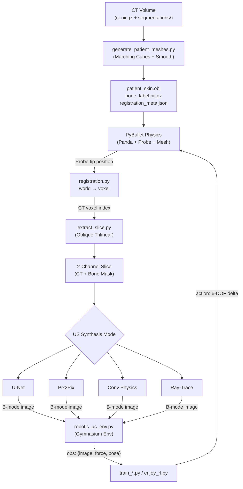

# CT-to-Ultrasound Robotic Scanning — Developer Guide

> Quick-reference handover document for new developers and future maintainers.  
> For setup instructions, see [README.md](file:///e:/DELL/internship/Data/HumanSubjects/HumanSubjects/ct_us/README.md).  
> For the theoretical deep-dive, see [PROJECT_DOCUMENTATION.md](file:///e:/DELL/internship/Data/HumanSubjects/HumanSubjects/ct_us/PROJECT_DOCUMENTATION.md).

---

## 1. What This Project Does

This project is an **end-to-end pipeline for autonomous robotic ultrasound scanning in simulation**. A Franka Emika Panda robot arm, equipped with a curved convex-array ultrasound probe, scans over a patient torso mesh inside a PyBullet physics simulation. At each step, the probe's world-space contact position is mapped to an exact voxel index inside a 3D CT volume via affine registration, a 2D oblique slice is extracted, and a synthetic B-mode ultrasound image is generated using one of four interchangeable methods (U-Net, Pix2Pix GAN, physics convolution, or ray-tracing).

The simulation is wrapped in a standard OpenAI Gymnasium environment and used to train **5 autonomous scanning algorithms**: A2C (+264.1 reward), SAC (+317.0, project best), PPO (-237.0), Behavioral Cloning (loss 2.0 from 68k real UR5 poses), and GAIL. Patient data comes from TotalSegmentator CT volumes processed into watertight skin meshes and merged bone labels.

---

## 2. Architecture at a Glance



### Module Dependency Graph

```
live_unet_demo.py  ←  robotic_us_env.py  ←  train_*.py / enjoy_rl.py
       ↑                      ↑
  registration.py         extract_slice.py
       ↑
generate_patient_meshes.py
```

> **⚠️ Key:** `live_unet_demo.py` is the **central hub** (2667 lines). `robotic_us_env.py` imports ~20 functions from it. Renaming or removing any exported symbol in `live_unet_demo.py` breaks the Gym environment and all training scripts.

---

## 3. File Reference

### Core Simulation

| File | Lines | Purpose |
|------|------:|---------|
| [live_unet_demo.py](file:///e:/DELL/internship/Data/HumanSubjects/HumanSubjects/ct_us/live_unet_demo.py) | 2667 | **Central hub.** PyBullet GUI + all 4 US synthesis modes + keyboard controls + eval mode. Contains `ModelBasedUSSimulator` class for physics-based US. |
| [robotic_us_env.py](file:///e:/DELL/internship/Data/HumanSubjects/HumanSubjects/ct_us/robotic_us_env.py) | 608 | **Gymnasium environment** (`RoboticUltrasoundGymEnv`). Wraps PyBullet + registration + slice extraction + synthesis. Action: 6-DOF continuous. Obs: `{image, force, pose}`. |
| [extract_slice.py](file:///e:/DELL/internship/Data/HumanSubjects/HumanSubjects/ct_us/extract_slice.py) | 187 | Registration-aware 2D oblique slicer. Extracts CT and bone slices from 3D volumes using trilinear interpolation at arbitrary position + orientation. |
| [registration.py](file:///e:/DELL/internship/Data/HumanSubjects/HumanSubjects/ct_us/registration.py) | 159 | Exact affine transforms between PyBullet world coords ↔ CT voxel indices. Core function: `compute_registered_ct_center()`. |

### Data Pipeline

| File | Lines | Purpose |
|------|------:|---------|
| [download_totalseg.py](file:///e:/DELL/internship/Data/HumanSubjects/HumanSubjects/ct_us/download_totalseg.py) | 153 | Streams 5 TotalSegmentator subjects from Zenodo (~3.24 GB ZIP). Cached after first download. |
| [generate_patient_meshes.py](file:///e:/DELL/internship/Data/HumanSubjects/HumanSubjects/ct_us/generate_patient_meshes.py) | 288 | CT → `patient_skin.obj` (marching cubes + Laplacian smooth) + `bone_label.nii.gz` (49 bone structures merged) + `registration_meta.json`. |
| [gen_data.py](file:///e:/DELL/internship/Data/HumanSubjects/HumanSubjects/ct_us/gen_data.py) | ~200 | Generates paired 2D training slices (CT + simulated US) from 3D patient volumes. |

### RL / IL Training & Evaluation

| File | Lines | Purpose |
|------|------:|---------|
| [train_a2c.py](file:///e:/DELL/internship/Data/HumanSubjects/HumanSubjects/ct_us/train_a2c.py) | 174 | A2C training via SB3. Peak reward **+264.1**. Default: 100k steps, n_steps=20, lr=7e-4. |
| [train_sac.py](file:///e:/DELL/internship/Data/HumanSubjects/HumanSubjects/ct_us/train_sac.py) | 160 | SAC training (off-policy). Peak reward **+317.0** — project best. Auto entropy tuning. |
| [train_ppo.py](file:///e:/DELL/internship/Data/HumanSubjects/HumanSubjects/ct_us/train_ppo.py) | 180 | PPO training. Benchmark result: -237.0. |
| [train_bc.py](file:///e:/DELL/internship/Data/HumanSubjects/HumanSubjects/ct_us/train_bc.py) | 203 | Behavioral Cloning from expert demos using `imitation` library + SB3 MultiInputPolicy. Loss 5.85 → 2.0. |
| [train_gail.py](file:///e:/DELL/internship/Data/HumanSubjects/HumanSubjects/ct_us/train_gail.py) | ~160 | GAIL (Generative Adversarial Imitation Learning) training. |
| [collect_demos.py](file:///e:/DELL/internship/Data/HumanSubjects/HumanSubjects/ct_us/collect_demos.py) | 461 | Parses Cavalcanti UR5 `RUS_pose.txt` files → normalized delta-actions → replays through env → saves `(obs, action)` pairs. |
| [enjoy_rl.py](file:///e:/DELL/internship/Data/HumanSubjects/HumanSubjects/ct_us/enjoy_rl.py) | 170 | Visual evaluation of any trained policy (A2C/SAC/PPO/BC/GAIL) in PyBullet GUI. Auto-detects algorithm from filename. |
| [test_gym_env.py](file:///e:/DELL/internship/Data/HumanSubjects/HumanSubjects/ct_us/test_gym_env.py) | ~100 | Environment diagnostic: 200 random steps, obs shape verification, FPS benchmark. |

### Generative Models (`model/` directory)

| File | Lines | Purpose |
|------|------:|---------|
| [model/model.py](file:///e:/DELL/internship/Data/HumanSubjects/HumanSubjects/ct_us/model/model.py) | 193 | 5-level U-Net. InstanceNorm + **Sigmoid** output `[0,1]`. 2-channel input (CT + bone), ~31M params. |
| [model/dataset.py](file:///e:/DELL/internship/Data/HumanSubjects/HumanSubjects/ct_us/model/dataset.py) | 230 | `CTSimUSDataset` — paired CT+bone+simUS loader. HU clipping `[-150, 1250]` → `[-1, 1]`. |
| [model/train.py](file:///e:/DELL/internship/Data/HumanSubjects/HumanSubjects/ct_us/model/train.py) | 448 | Training loop: L1 loss, Adam `lr=2e-4`, CosineAnnealingLR, AMP, gradient clipping. |
| [model/prepare_cavalcanti.py](file:///e:/DELL/internship/Data/HumanSubjects/HumanSubjects/ct_us/model/prepare_cavalcanti.py) | 1229 | Cavalcanti dataset preprocessor: DICOM loading, bone thresholding, STL mesh parsing, PCA pre-alignment + ICP registration, 3D oblique reslicing. |
| [model/inference.py](file:///e:/DELL/internship/Data/HumanSubjects/HumanSubjects/ct_us/model/inference.py) | ~200 | Batch inference with PSNR / SSIM / MAE evaluation. |
| [model/pix2pix/model.py](file:///e:/DELL/internship/Data/HumanSubjects/HumanSubjects/ct_us/model/pix2pix/model.py) | ~200 | Pix2Pix U-Net variant — **Tanh** output `[-1,1]`. |
| [model/pix2pix/discriminator.py](file:///e:/DELL/internship/Data/HumanSubjects/HumanSubjects/ct_us/model/pix2pix/discriminator.py) | ~150 | PatchGAN discriminator for adversarial training. |
| [model/pix2pix/train_pix2pix.py](file:///e:/DELL/internship/Data/HumanSubjects/HumanSubjects/ct_us/model/pix2pix/train_pix2pix.py) | ~670 | Full Pix2Pix GAN training loop. |
| [model/train_ultrabones.py](file:///e:/DELL/internship/Data/HumanSubjects/HumanSubjects/ct_us/model/train_ultrabones.py) | ~400 | Training on UltraBones100k ex-vivo dataset. |
| [model/ultrabones_dataset.py](file:///e:/DELL/internship/Data/HumanSubjects/HumanSubjects/ct_us/model/ultrabones_dataset.py) | ~130 | UltraBones100k dataset loader. |

### Utilities & Wrappers

| File | Purpose |
|------|---------|
| [gail_wrapper.py](file:///e:/DELL/internship/Data/HumanSubjects/HumanSubjects/ct_us/gail_wrapper.py) | GAIL helpers: `FlattenMultiInputWrapper`, `CustomFlatFeatureExtractor`, `FlatRewardNet` |
| [profile_env.py](file:///e:/DELL/internship/Data/HumanSubjects/HumanSubjects/ct_us/profile_env.py) | Environment profiling / timing analysis |
| [evaluate_pix2pix.py](file:///e:/DELL/internship/Data/HumanSubjects/HumanSubjects/ct_us/evaluate_pix2pix.py) | Pix2Pix evaluation script |
| [example_integration.py](file:///e:/DELL/internship/Data/HumanSubjects/HumanSubjects/ct_us/example_integration.py) | Standalone Gymnasium usage examples |

### Legacy / Reference (not actively used)

| File | Purpose |
|------|---------|
| `sonobot_sonogym_v2 (1) (1).py` | SonoGym paper reference implementation (CycleGAN, FanBeam renderer, etc.) |
| `use_this.py` | Older prototype with `Tissue`, `SyntheticTorsoVolume`, `FanBeamUSRenderer` classes |
| `check_*.py`, `inspect_*.py`, `debug_*.py` | One-off debugging / inspection scripts (safe to ignore) |

---

## 4. Trained Models & Checkpoints

### Generative Model Checkpoints (`.pth`)

| Checkpoint | Model | Output Activation | Input |
|------------|-------|--------------------|-------|
| `model/runs/exp1_2IP/exp1/best_model.pth` | **2-channel U-Net** (default) | Sigmoid `[0,1]` | CT + bone mask |
| `model/runs/exp_pix2pix/best_model.pth` | Pix2Pix GAN | Tanh `[-1,1]` | CT + bone mask |

### RL / IL Policy Checkpoints (`.zip`)

| Checkpoint | Algorithm | Performance | Size |
|------------|-----------|-------------|-----:|
| `a2c_checkpoints/a2c_final_model.zip` | A2C | +264.1 reward | ~17 MB |
| `sac_checkpoints/sac_final_model.zip` | **SAC** | **+317.0 reward** (best) | ~188 MB |
| `bc_checkpoints/bc_policy.zip` | Behavioral Cloning | loss 2.0, prob_true_act 20.3% | ~4.3 MB |
| `gail_checkpoints/gail_policy.zip` | GAIL | — | ~5.2 MB |
| `bc_checkpoints_robust/bc_policy.zip` | BC (robust variant) | — | ~4.3 MB |

> **⚠️ DO NOT DELETE** any of these checkpoints. They represent weeks of GPU training.

---

## 5. Quick-Start Commands

### First-Time Setup

```bash
git clone https://github.com/Vedansh076/ct-us-robotic-scanning.git
cd ct-us-robotic-scanning
pip install torch torchvision pybullet gymnasium stable-baselines3[extra] \
            nibabel scikit-image scipy opencv-python trimesh tqdm
python download_totalseg.py
python generate_patient_meshes.py --input-dir totalseg_patients --smooth-iter 10
```

### Interactive Simulation (4 US modes)

```bash
python live_unet_demo.py --sim-mode unet       # Neural net U-Net (needs GPU)
python live_unet_demo.py --sim-mode pix2pix     # Pix2Pix GAN (needs GPU)
python live_unet_demo.py --sim-mode conv        # Physics convolution (CPU only)
python live_unet_demo.py --sim-mode ray         # Snell's law ray-tracing (CPU only)
```

### RL Training (recommended: remote server)

```bash
nohup taskset -c 0,1,2,3 python3 train_sac.py --timesteps 100000 --save-freq 20000 > train_sac.log 2>&1 &
nohup taskset -c 0,1,2,3 python3 train_a2c.py --timesteps 150000 --save-freq 30000 > train_a2c.log 2>&1 &
nohup taskset -c 0,1,2,3 python3 train_ppo.py --timesteps 100000 --n-steps 2048 > train_ppo.log 2>&1 &
```

### Imitation Learning

```bash
python3 collect_demos.py --data-root data/Cavalcanti --output-dir demos/ --stride 15
nohup python3 train_bc.py --demos-dir demos/ --epochs 50 > train_bc.log 2>&1 &
```

### Evaluate Any Trained Policy

```bash
python enjoy_rl.py --checkpoint sac_checkpoints/sac_final_model.zip        # SAC (best)
python enjoy_rl.py --checkpoint a2c_checkpoints/a2c_final_model.zip        # A2C
python enjoy_rl.py --checkpoint bc_checkpoints/bc_policy.zip --algo bc     # BC
python enjoy_rl.py --checkpoint gail_checkpoints/gail_policy.zip --algo gail  # GAIL
```

### Model Evaluation

```bash
python live_unet_demo.py --checkpoint model/runs/exp1_2IP/exp1/best_model.pth --eval
```

### Environment Diagnostic

```bash
python test_gym_env.py --headless    # Verify env init + 200 steps + FPS benchmark
```

---

## 6. Key Technical Concepts

### Coordinate Registration

The probe's world-space position must be mapped to an exact CT voxel index. This requires a 5-step affine chain:

```
CT voxel (i,j,k) → NIfTI affine → physical mm → meters → mesh centering → body rotation → PyBullet world
```

And the exact inverse for the runtime path (world → voxel). The `registration_meta.json` file stores the affine, inverse affine, spacing, and mesh centering offset. See [registration.py](file:///e:/DELL/internship/Data/HumanSubjects/HumanSubjects/ct_us/registration.py) and [PROJECT_DOCUMENTATION.md §2.2](file:///e:/DELL/internship/Data/HumanSubjects/HumanSubjects/ct_us/PROJECT_DOCUMENTATION.md).

### 2-Channel Input

The generative models take **2 input channels**: Channel 1 = CT intensity slice (normalized), Channel 2 = binary bone segmentation mask. The bone mask provides an explicit structural prior for acoustic shadowing and specular bone reflections.

### Strategy 2 Training (skip_unet)

During RL training, U-Net inference is **skipped** (`skip_unet=True`). The binary bone mask is used directly as the `"image"` observation. This achieves **~440 FPS** vs ~12 FPS with U-Net. The learned policy transfers to U-Net observations at evaluation time because the brightest feature in a real B-mode image is the specular bone reflection — present in both the mask and U-Net output.

### Spring Contact Model

Contact force is estimated via a virtual spring: `F = k × (standoff − distance)`, where `k=800 N/m` and `standoff=3mm`. Target force: 2–8N. Safety termination: >12N. These values are calibrated together.

### 4 Ultrasound Synthesis Modes

| Mode | Method | GPU | Key Features |
|------|--------|:---:|-------------|
| `unet` | 2-channel U-Net | ✅ | Trained on Cavalcanti spine data, Sigmoid output |
| `pix2pix` | Conditional GAN | ✅ | Sharper textures, Tanh output |
| `conv` | Physics v3 convolution | ❌ | Rayleigh speckle, CT backscatter, carrier PSF, attenuation |
| `ray` | Snell's law ray-tracing | ❌ | Refraction at tissue boundaries, shadow ratio 0.49 |

---

## 7. Gymnasium Environment Reference

### Action Space

`Box(low=-1, high=1, shape=(6,), dtype=float32)` — 6-DOF continuous:

| Index | Dimension | Scale |
|:-----:|-----------|-------|
| 0–2 | dx, dy, dz | × 0.01 m (±1 cm/step) |
| 3–5 | d_roll, d_pitch, d_yaw | × 0.05 rad (±2.9°/step) |

### Observation Space

`Dict` with keys:

| Key | Shape | Type | Description |
|-----|-------|------|-------------|
| `"image"` | `(256, 256)` | `uint8` | B-mode US image or bone mask |
| `"force"` | `(1,)` | `float32` | Contact force (Newtons) |
| `"pose"` | `(7,)` | `float32` | EE position (xyz) + quaternion (xyzw) |

### Reward Components

| Component | Value | When |
|-----------|-------|------|
| R_f (force) | +1.0 | Good contact: 2N ≤ F ≤ 8N |
| R_f | +0.5 × F | Light contact: 0 < F < 2N |
| R_f | −1.0 × (F−8) | Over-pressure: F > 8N |
| R_f | −2.0 | No contact: F = 0 |
| R_b (bone) | +1.5 | Bone pixels visible in slice |
| R_sweep | +0.5 × \|action_y\| | Longitudinal sweep in contact over bone |
| R_jerk | −0.1 × ‖Δaction‖² | Always (penalizes inter-step jerk) |

### Termination

| Condition | Type |
|-----------|------|
| Contact force > 12 N | `terminated = True` (safety) |
| No contact for 30 steps | `terminated = True` |
| 200 steps elapsed | `truncated = True` (episode horizon) |

---

## 8. Patient Data Structure

5 subjects from TotalSegmentator: **s0011, s0058** (default), **s0223, s0250, s0310**.

```
totalseg_patients/s0058/
├── ct.nii.gz              ← Raw 3D CT volume
├── segmentations/         ← 49 per-structure NIfTI masks (body, vertebrae, ribs, ...)
├── patient_skin.obj       ← Watertight skin mesh (generated by generate_patient_meshes.py)
├── bone_label.nii.gz      ← Merged binary bone mask (generated)
└── registration_meta.json ← Affine matrices + spacing + centering offset (generated)
```

The last 3 files are **generated** by `generate_patient_meshes.py` — they are not part of the raw TotalSegmentator download.

---

## 9. Known Gotchas & Pitfalls

> **Read this before modifying ANY core file.** These bugs were discovered and fixed during development. Re-introducing any of them will silently break the simulation.

- **U-Net vs Pix2Pix activation mismatch:** `model/model.py` UNet uses **Sigmoid** `[0,1]`. `model/pix2pix/model.py` UNet uses **Tanh** `[-1,1]`. **Never swap these imports** in training or inference code. The wrong activation causes grey-filled, low-contrast predictions.

- **HU windowing:** Training clips CT to `[-150, 1250]` HU → `[-1, 1]`. Inference **MUST** use the same range. A mismatched window (e.g. `[-200, 300]`) causes out-of-distribution predictions.

- **Mesh winding order:** `generate_patient_meshes.py` inverts triangle winding with `faces[:, [0, 2, 1]]`. **Do not remove this.** Without it, PyBullet's back-face culling makes meshes appear hollow/transparent.

- **Zero-padding before marching cubes:** The binary body volume **must** be zero-padded on all 6 faces before `marching_cubes()`. Without padding, the isosurface has open borders (not a closed manifold) and PyBullet collision detection fails.

- **Robot occlusion in raycasts:** Always use `raycast_skin_surface()` (which ignores robot links) — not raw PyBullet raycasts. Raw raycasts hit the robot arm geometry above the patient, causing false "miss" results.

- **DummyVecEnv, not SubprocVecEnv:** PyBullet physics clients and CUDA contexts **cannot** be safely forked across processes. `SubprocVecEnv` will cause silent corruption.

- **PyTorch 2.6+ compatibility:** `torch.load()` requires `weights_only=False` for SB3 checkpoints. This is monkey-patched in `enjoy_rl.py`.

- **Large files are git-ignored:** `.nii.gz`, `.obj`, `.pth`, `.zip`, `.png`, `.npy` are all in `.gitignore`. Only Python code and markdown docs are tracked. Checkpoints and patient data must be transferred separately.

- **Action/Observation space is frozen:** Changing the Gym env's action shape `(6,)` or observation shapes breaks **all** trained checkpoints. Any new feature must be added as a new obs key, not by resizing existing ones.

---

## 10. Dependencies

| Package | Min Version | Purpose |
|---------|-------------|---------|
| Python | 3.9 – 3.11 | Runtime |
| PyTorch | ≥ 2.0 | U-Net / Pix2Pix inference & training |
| torchvision | ≥ 0.16 | Image transforms |
| PyBullet | ≥ 3.2 | Physics simulation |
| Gymnasium | ≥ 0.29 | RL environment interface |
| Stable-Baselines3 | ≥ 2.0 | RL algorithms (A2C, PPO, SAC) |
| nibabel | ≥ 5.0 | NIfTI volume I/O |
| scikit-image | ≥ 0.21 | `marching_cubes`, `match_histograms` |
| scipy | ≥ 1.11 | `ndimage.map_coordinates` for slice extraction |
| OpenCV (cv2) | ≥ 4.8 | Image display, HUD overlay |
| NumPy | ≥ 1.24 | Array operations |
| trimesh | — | Mesh I/O and Laplacian smoothing |
| tqdm | — | Progress bars |
| imitation | ≥ 1.0 | BC / GAIL training (optional) |
| pydicom | — | Cavalcanti DICOM preprocessing (optional) |

```bash
# Full install
pip install torch torchvision pybullet gymnasium stable-baselines3[extra] \
            nibabel scikit-image scipy opencv-python trimesh tqdm imitation
```

---

## 11. Documentation Map

| Document | What It Covers |
|----------|---------------|
| [README.md](file:///e:/DELL/internship/Data/HumanSubjects/HumanSubjects/ct_us/README.md) | Setup, installation, all commands, environment reference, git workflow |
| [DEVELOPER_GUIDE.md](file:///e:/DELL/internship/Data/HumanSubjects/HumanSubjects/ct_us/DEVELOPER_GUIDE.md) | **This file.** Quick-reference handover for new developers |
| [PROJECT_DOCUMENTATION.md](file:///e:/DELL/internship/Data/HumanSubjects/HumanSubjects/ct_us/PROJECT_DOCUMENTATION.md) | Deep-dive: coordinate registration math, module walkthroughs, RL design, bug history |
| [commands.md](file:///e:/DELL/internship/Data/HumanSubjects/HumanSubjects/ct_us/commands.md) | Central CLI command reference for every script |
| [COLAB_INSTRUCTIONS.md](file:///e:/DELL/internship/Data/HumanSubjects/HumanSubjects/ct_us/COLAB_INSTRUCTIONS.md) | Step-by-step Google Colab training guide |
| [model/NOTES.md](file:///e:/DELL/internship/Data/HumanSubjects/HumanSubjects/ct_us/model/NOTES.md) | U-Net architecture decisions and hyperparameter rationale |
| [SONOGYM_ANALYSIS.md](file:///e:/DELL/internship/Data/HumanSubjects/HumanSubjects/ct_us/SONOGYM_ANALYSIS.md) | Analysis of the SonoGym paper (reference) |
| [agent.md](file:///e:/DELL/internship/Data/HumanSubjects/HumanSubjects/ct_us/agent.md) | AI agent session-to-session context tracker (bugs, decisions, focus) |
| [task.md](file:///e:/DELL/internship/Data/HumanSubjects/HumanSubjects/ct_us/task.md) | Project roadmap and task completion checklist |
| [.agents/AGENTS.md](file:///e:/DELL/internship/Data/HumanSubjects/HumanSubjects/ct_us/.agents/AGENTS.md) | AI agent rules: critical invariants, testing requirements, architecture |

---

## 12. Project Status (as of July 2026)

All planned stages are **complete**:

| Stage | Description | Status |
|:-----:|-------------|:------:|
| 0 | TotalSegmentator patient data pipeline | ✅ Complete |
| 1 | Coordinate registration consolidation | ✅ Complete |
| 2 | Generative realism (histogram matching) | ✅ Complete |
| 3 | Gymnasium env + RL benchmarks (A2C, SAC, PPO) | ✅ Complete |
| 4 | Imitation learning (BC, GAIL from Cavalcanti) | ✅ Complete |
| — | Physics-based US simulators (conv, ray) | ✅ Complete |

The original developer is no longer actively working on this project. All critical knowledge is documented in these files. For AI agents maintaining this codebase, see [.agents/AGENTS.md](file:///e:/DELL/internship/Data/HumanSubjects/HumanSubjects/ct_us/.agents/AGENTS.md) for rules and invariants.
