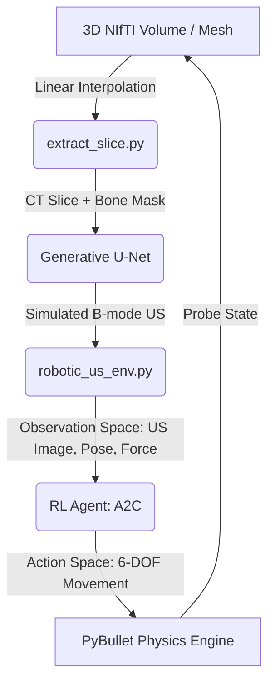

# CT-to-Ultrasound Robotic Scanning: Codebase Documentation

This document provides a comprehensive overview of the system architecture, core codebase files, coordinate registration pipeline, and reinforcement learning strategies designed for the automated robotic ultrasound scanning project.

---

## 1. System Overview & Architecture

The goal of this project is to train an autonomous robotic agent (Franka Emika Panda arm) equipped with an ultrasound probe to scan a patient torso (or limb) and locate specific anatomical structures (like the spine or bones). 

The system relies on a **generative deep learning model** (U-Net) to synthesize realistic ultrasound images from 3D CT volumes in real-time, which are then used by a **deep reinforcement learning agent** (A2C) to learn optimal scanning trajectories.



---

## 2. Codebase Map (Directory Structure)

```
ct_us/
├── robotic_us_env.py          # Core Gymnasium Environment (PyBullet + Slicing)
├── train_a2c.py               # Reinforcement Learning (A2C) training script
├── test_gym_env.py            # Diagnostic script to verify env, observations, & speed
├── live_unet_demo.py          # Interactive PyBullet GUI visualization with live U-Net
├── extract_slice.py           # Linear interpolation engine for extracting 2D slices from 3D NIfTI
├── registration.py            # Coordinate transformations (LPS/RAS to PyBullet world)
├── COLAB_INSTRUCTIONS.md      # Setup guide for high-speed cloud training on Google Colab
│
├── model/                     # Generative U-Net Module
│   ├── model.py               # PyTorch U-Net architecture definition
│   ├── dataset.py             # Custom Dataset loader for paired CT/US volumes
│   ├── train.py               # Supervised training loop (CT -> SimUS translation)
│   ├── reference_ct_slice.npy # Histogram template for intensity normalization
│   └── runs/
│       └── exp1_2IP/exp1/     # Pre-trained U-Net weights (best_model.pth)
│
└── totalseg_patients/         # Patient Volume & Mesh Data
    └── s0058/                 # Active training patient
        ├── ct.nii.gz          # Raw 3D CT Volume
        ├── bone_label.nii.gz  # 3D Bone segmentation volume
        ├── patient_skin.obj   # 3D outer skin mesh for collision physics
        └── registration_meta.json # Spatial offset and alignment metadata
```

---

## 3. Core Component Walkthrough

### 3.1. Slicing Engine (`extract_slice.py`)
Because running full GPU wave simulations in an RL loop is too slow, we extract 2D slices from 3D CT scans in real-time using linear interpolation.
*   **Coordinate mapping:** It maps the 2D pixel coordinates of the virtual probe head into the 3D CT coordinate space using a homogeneous transformation matrix ($T_{\text{probe\_to\_volume}}$).
*   **Interpolation:** It uses `scipy.ndimage.map_coordinates` to sample intensity values from the CT and bone label volumes at the mapped 3D points.

### 3.2. Coordinate Registration (`registration.py`)
NIfTI volumes use the clinical **LPS** (Left-Posterior-Superior) coordinate system, while PyBullet uses a standard right-handed Cartesian coordinate system with a specific origin.
*   **Centering Offset:** It parses `registration_meta.json` to extract the spatial offset needed to center the patient mesh on the examination bed in PyBullet.
*   **Matrix Transformations:** It aligns the virtual probe's physical contact point in PyBullet with the exact slicing plane inside the CT volume, accounting for scaling and orientation offsets.

### 3.3. Gymnasium Environment (`robotic_us_env.py`)
This class wraps the PyBullet physics simulation and slice extraction into a standard OpenAI Gym interface.
*   **Action Space:** 6-DOF continuous relative controls (`[dx, dy, dz, droll, dpitch, dyaw]`) in range `[-1, 1]`.
*   **Observation Space:** A dictionary containing:
    *   `"image"`: $256 \times 256$ ultrasound image (or binary bone mask).
    *   `"pose"`: Current 7-axis position and orientation of the probe.
    *   `"force"`: Contact force normal to the skin.
*   **Reward Function:** Penalizes losing contact with the skin and deviation from the centerline, while rewarding alignment with the target bone structure.

---

## 4. Reinforcement Learning Training Strategies

To train the RL agent efficiently, we implemented two separate strategies:

### Strategy 1: Full-Loop Training (U-Net Enabled)
*   **Mechanism:** The environment runs the U-Net model on the GPU during the RL loop. Every step extracts a CT slice, passes it through the U-Net, and feeds the synthesized ultrasound image to the agent.
*   **Trade-off:** High fidelity, but slow due to sequential CPU-to-GPU data transfer overhead (~12 FPS).

### Strategy 2: Mask-Based Training (U-Net Bypassed)
*   **Mechanism:** Bypasses U-Net inference entirely during training. The `"image"` observation is populated directly with the binary bone mask (`seg_slice`).
*   **Why it works:** The agent learns to navigate based on the shape of the bone boundary. At evaluation time, the U-Net is turned back on. Since the bone boundary is the brightest feature in the ultrasound image, the agent's policy naturally transfers to the real ultrasound texture.
*   **Trade-off:** Fast, lightweight, and achieves up to **440 FPS** on isolated environments (Colab), completing a 100k-step run in **~27 minutes**.
