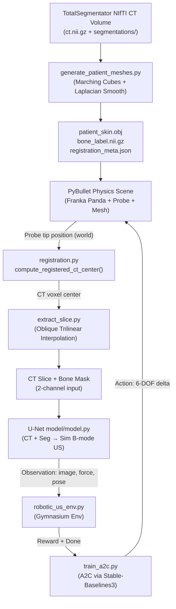

# CT-to-Ultrasound Robotic Scanning: Technical Architecture & Design Reference

This document is the deep-dive technical reference for the CT-to-Ultrasound Robotic Scanning project. It covers the system architecture, coordinate registration mathematics, module-by-module walkthroughs, reinforcement learning design, and known bugs/decisions.

For a quick-start guide, see [README.md](README.md).

---

## Table of Contents

1. [System Architecture Overview](#1-system-architecture-overview)
2. [Module Reference](#2-module-reference)
   - 2.1 [Slicing Engine — `extract_slice.py`](#21-slicing-engine--extract_slicepy)
   - 2.2 [Coordinate Registration — `registration.py`](#22-coordinate-registration--registrationpy)
   - 2.3 [Patient Mesh Generator — `generate_patient_meshes.py`](#23-patient-mesh-generator--generate_patient_meshespy)
   - 2.4 [Generative U-Net — `model/`](#24-generative-u-net--model)
   - 2.5 [Gymnasium Environment — `robotic_us_env.py`](#25-gymnasium-environment--robotic_us_envpy)
   - 2.6 [Interactive GUI — `live_unet_demo.py`](#26-interactive-gui--live_unet_demopy)
   - 2.7 [A2C Training Script — `train_a2c.py`](#27-a2c-training-script--train_a2cpy)
3. [Reinforcement Learning Design](#3-reinforcement-learning-design)
4. [Known Bugs & Technical Decisions](#4-known-bugs--technical-decisions)
5. [Codebase Map](#5-codebase-map)

---

## 1. System Architecture Overview

The project is structured as a pipeline of five tightly coupled components:



**Data flow summary:**

1. The patient's 3D CT is converted into a closed surface mesh for the physics engine and a bone label volume for the U-Net.
2. The Panda arm + probe are loaded into PyBullet. At each simulation step, the probe tip's world coordinates are raycasted against the skin mesh to compute contact force.
3. The probe's world position is mapped to an exact CT voxel index via the registration pipeline (accounting for NIfTI affine, mesh centering, body placement, and mesh scale).
4. A 2D oblique slice is extracted from both the CT volume and the bone label volume using trilinear interpolation.
5. The 2-channel slice is fed through the U-Net to produce a synthetic B-mode ultrasound image.
6. The image, force, and pose form the RL observation. The A2C agent outputs a 6-DOF action delta.

---

## 2. Module Reference

### 2.1 Slicing Engine — `extract_slice.py`

**Purpose:** Extract a 2D oblique image plane from a 3D NIfTI volume at an arbitrary position and orientation.

Because running a full acoustic wave simulation is computationally prohibitive inside an RL loop, we instead extract a 2D cross-section from the CT volume using fast trilinear interpolation (`scipy.ndimage.map_coordinates`). This simulates what a physical ultrasound transducer would "see" at its current location.

**Key function: `extract_slice(volume, center, quaternion, spacing, ...)`**

The function constructs a grid of pixel coordinates relative to the probe's center in voxel space, then samples the volume at those points.

**Coordinate transform chain (registration-aware mode):**

When the `inv_affine` parameter is provided (the standard production path), each pixel offset along the slice plane's `u` (lateral) and `w` (depth) axes is transformed through the full inverse registration chain:

$$
\vec{u}_{\text{voxel}} = M_{\text{inv}}^{3\times3} \cdot \frac{R_{\text{body}}^T \cdot (\delta_{\text{mm}} \cdot \vec{u}_{\text{world}})}{\text{mesh\_scale}}
$$

Where:
- $\vec{u}_{\text{world}}$ is the probe's lateral unit vector in PyBullet world space (from quaternion).
- $R_{\text{body}}^T$ undoes the patient mesh's body rotation in PyBullet.
- Dividing by `mesh_scale` undoes any non-isotropic PyBullet mesh scaling.
- $M_{\text{inv}}^{3\times3}$ is the upper-left 3×3 of the inverse NIfTI affine, converting physical mm offsets to voxel offsets (including any LPS rotation embedded in the NIfTI header).

This guarantees that the extracted slice plane is **perfectly aligned** with the underlying CT anatomy, eliminating diagonal cropping artifacts that appear when the NIfTI affine has a rotation component.

**Legacy mode (no `inv_affine`):** Falls back to the classic approach of dividing world-space mm offsets by voxel spacing — only correct if CT voxel axes are perfectly aligned with the world axes.

---

### 2.2 Coordinate Registration — `registration.py`

**Purpose:** Convert a probe contact point in PyBullet world coordinates to an exact CT voxel index, and vice versa.

This is the mathematical core of the project. NIfTI volumes store data in **LPS** (Left-Posterior-Superior) physical scanner coordinates, while PyBullet uses a standard right-handed Cartesian system with a world origin on the hospital bed. The registration pipeline bridges these two spaces without any heuristic scaling or bounding-box normalization.

#### Forward Transform (voxel → world)

$$
\underbrace{(i, j, k)}_{\text{CT voxel}}
\xrightarrow{\text{NIfTI affine}} \underbrace{(x, y, z)_{\text{mm}}}_{\text{scanner physical}}
\xrightarrow{\div 1000} \underbrace{(x, y, z)_{\text{m}}}_{\text{physical meters}}
\xrightarrow{- \text{offset}} \underbrace{\mathbf{p}_{\text{centered}}}_{\text{mesh space}}
\xrightarrow{R_{\text{body}} \cdot + T_{\text{body}}} \underbrace{\mathbf{p}_{\text{world}}}_{\text{PyBullet}}
$$

#### Inverse Transform (world → voxel) — `compute_registered_ct_center()`

$$
\underbrace{\mathbf{p}_{\text{world}}}_{\text{PyBullet}}
\xrightarrow{R_{\text{body}}^T \cdot (- T_{\text{body}})} \underbrace{\mathbf{p}_{\text{centered}}}_{\text{mesh space}}
\xrightarrow{\div \text{scale}} \underbrace{\mathbf{p}_{\text{m}}}_{\text{physical meters}}
\xrightarrow{+ \text{offset}} \underbrace{\mathbf{p}_{\text{m, abs}}}_{\text{absolute meters}}
\xrightarrow{\times 1000} \underbrace{\mathbf{p}_{\text{mm}}}_{\text{scanner mm}}
\xrightarrow{A^{-1}} \underbrace{(i, j, k)}_{\text{CT voxel}}
$$

The result is clamped to the valid CT volume bounds. If the world hit position is `None` (raycast miss), the function returns the volume center as a fallback.

**Key functions:**

| Function | Description |
|---|---|
| `load_registration_meta(json_path)` | Loads `registration_meta.json` and returns a dict with affine matrices (as NumPy arrays), CT shape, voxel spacing, and the mesh centering offset. |
| `compute_registered_ct_center(...)` | Inverse transform: PyBullet world → CT voxel. Used every simulation step. |
| `voxel_to_world(...)` | Forward transform: CT voxel → PyBullet world. Used for validation and debugging. |

---

### 2.3 Patient Mesh Generator — `generate_patient_meshes.py`

**Purpose:** Convert raw TotalSegmentator CT volumes into the three files the simulation requires: `patient_skin.obj`, `bone_label.nii.gz`, and `registration_meta.json`.

**Processing steps:**

1. **Load CT volume** — Load `ct.nii.gz` via nibabel. Extract the NIfTI affine matrix.
2. **Build body mask** — Load `segmentations/body.nii.gz`. Zero-pad the binary volume on all six faces before running marching cubes. This padding is critical: it guarantees that the isosurface is closed (a solid manifold) rather than an open shell with holes at the volume border.
3. **Run marching cubes** — `skimage.measure.marching_cubes` at level 0.5 produces vertices (in voxel space) and face triangles.
4. **Convert to physical meters** — Multiply vertices by voxel spacing (mm) and divide by 1000.
5. **Center the mesh** — Subtract the centroid offset so the mesh is centered at the origin. Save this `mesh_centering_offset` to `registration_meta.json` for the registration pipeline.
6. **Laplacian smoothing** — Apply 10 iterations of Laplacian smoothing to remove voxel staircase artifacts.
7. **Fix winding order** — Invert triangle faces (`faces[:, [0, 2, 1]]`) so all normals point outward. Without this, PyBullet's back-face culling renders the mesh as transparent/hollow.
8. **Merge bone structures** — Load all 49 per-structure segmentation masks (vertebrae, ribs, pelvis, sternum, shoulders), take their union (`np.logical_or`), and save as `bone_label.nii.gz`.
9. **Save registration metadata** — Write `registration_meta.json` with the affine, inverse affine, voxel spacing, CT shape, centering offset, and mesh statistics.

**Usage:**
```bash
python generate_patient_meshes.py --input-dir totalseg_patients --smooth-iter 10
```

---

### 2.4 Generative U-Net — `model/`

**Purpose:** Learn a mapping from paired (CT slice + bone mask) → simulated B-mode ultrasound image using supervised image-to-image translation.

#### Architecture (`model/model.py`)

A 5-level encoder–bottleneck–decoder U-Net with skip connections:

```
Input: (B, 2, 256, 256)   ← [CT slice (normalized), bone mask (binary)]
  │
  ├─ DownBlock enc1 → (B, 64, 128, 128)   + skip s1
  ├─ DownBlock enc2 → (B, 128, 64, 64)    + skip s2
  ├─ DownBlock enc3 → (B, 256, 32, 32)    + skip s3
  ├─ DownBlock enc4 → (B, 512, 16, 16)    + skip s4
  │
  ├─ Bottleneck ConvBlock → (B, 512, 8, 8)
  │
  ├─ Dropout2d on bottleneck + s4 (regularization)
  ├─ UpBlock dec4: upsample + concat(s4) → (B, 256, 16, 16)
  ├─ UpBlock dec3: upsample + concat(s3) → (B, 128, 32, 32)
  ├─ UpBlock dec2: upsample + concat(s2) → (B, 64, 64, 64)
  ├─ UpBlock dec1: upsample + concat(s1) → (B, 32, 128, 128)
  │
  └─ Head: 1×1 Conv → Sigmoid → (B, 1, 256, 256)   ← simulated US in [0, 1]
```

- **DownBlock** = `ConvBlock(LeakyReLU) + MaxPool2d`
- **ConvBlock** = `Conv3×3 → InstanceNorm2d → Activation` (×2)
- **UpBlock** = `Bilinear upsample → Concat skip → ConvBlock(ReLU)`
- **InstanceNorm** is preferred over BatchNorm for small-batch medical image translation (normalizes per-sample, not per-batch).
- Total parameters: ~31 M (with `base_features=64`).

#### Normalization (`model/dataset.py`)

| Channel | Clipping | Scaling |
|---|---|---|
| CT input | `[-150, 1250]` HU | → `[−1, 1]` |
| Bone mask | Binary `{0, 1}` | No scaling needed |
| SimUS target | `[0, 220]` intensity | → `[0, 1]` |

#### Loss Function

**L1 loss** (Mean Absolute Error) is used rather than L2 because:
- L1 produces sharper predictions — L2's quadratic penalty causes blurry mean predictions.
- L1 is more robust to CT metal implant outliers.
- L1 is the standard reconstruction loss in paired image translation (as used in Pix2Pix).

#### Training (`model/train.py`)

- **Optimizer:** Adam (`lr=2e-4`, `weight_decay=1e-5`)
- **LR Schedule:** `CosineAnnealingLR` from `2e-4` to `2e-6` over 100 epochs.
- **Mixed Precision:** AMP (Automatic Mixed Precision) with `torch.cuda.amp` for speed.
- **Checkpointing:** Saves `best_model.pth` whenever validation loss improves.
- **Data Split:** Subject-level split (not slice-level) to prevent data leakage from near-identical adjacent slices.

#### Histogram Matching (`live_unet_demo.py`)

The `--no-match-histogram` flag disables `skimage.exposure.match_histograms` in the inference path. By default, histogram matching is enabled to align the intensity distribution of each incoming live CT slice to the saved reference distribution in `model/reference_ct_slice.npy`. This reduces the domain gap between TotalSegmentator CT data (used in simulation) and the TCGA CT data the model was trained on.

---

### 2.5 Gymnasium Environment — `robotic_us_env.py`

**Purpose:** Wrap the PyBullet simulation, registration pipeline, and U-Net into a standard `gymnasium.Env` interface compatible with any Stable-Baselines3 algorithm.

#### Initialization

The environment performs the following on `__init__`:
1. Loads the CT and bone label volumes using `load_ct_subject()`.
2. Optionally loads the U-Net model (skipped if `skip_unet=True`).
3. Connects to PyBullet (GUI if `render_mode="human"`, headless if `"rgb_array"`).
4. Creates the hospital room scene, patient skin mesh, Panda robot, and probe visual model.
5. Hides gripper fingers (links 9 and 10) permanently to replicate a fingerless probe mount.

#### Reset

1. Raycasts vertically downward from above the patient's mesh centroid to find the skin surface Z.
2. Uses PyBullet inverse kinematics (`calculateInverseKinematics`) to drive the arm to an approach pose 10 cm above the surface, then settles 8 mm above contact.
3. Steps the simulation 60 times to let physics settle.

#### Observation (`_get_obs`)

1. **Pose:** Reads EE link state (position + quaternion).
2. **Force:** Estimates contact force via raycast from the probe tip through the skin mesh. The distance-to-surface is converted to a force estimate using a linear spring model capped at 10 N.
3. **Image:** If the probe is in contact (`hit_distance ≤ 0.05 m`), maps the probe tip to a CT voxel using `compute_registered_ct_center()`, extracts CT and bone slices using `extract_slice()`, and either runs U-Net inference or directly binarizes the bone mask.

#### Step

1. Decodes the 6-DOF action into position delta (±1 cm) and orientation delta (±2.9°).
2. Clamps the target position to the bed bounds and clamps the Euler angles to prevent gimbal flips.
3. Drives the robot using `drive_panda_to_pose()` (position motor control via IK).
4. Steps physics 5 times, then collects the new observation.
5. Computes reward and checks termination conditions.

#### Action Bounds

```python
target_pos[0] = np.clip(target_pos[0], -0.45, 0.45)      # X: ±45 cm (bed width)
target_pos[1] = np.clip(target_pos[1], -0.80, 0.80)      # Y: ±80 cm (bed length)
target_euler[0] = np.clip(target_euler[0], π ± 0.4)       # roll
target_euler[1] = np.clip(target_euler[1], ±0.4)          # pitch
target_euler[2] = np.clip(target_euler[2], ±0.6)          # yaw
```

---

### 2.6 Interactive GUI — `live_unet_demo.py`

**Purpose:** Provide a real-time interactive visualization of the full pipeline — PyBullet physics + probe kinematics + registration + slice extraction + U-Net inference — all in a single interactive session.

Key features implemented in `live_unet_demo.py`:

- **`create_hospital_room()`** — Loads the hospital floor, examination bed, and mattress. Returns the mattress top Z coordinate.
- **`create_registered_body_mesh()`** — Loads `patient_skin.obj`, places it on the bed centered on the mattress, and loads `registration_meta.json`.
- **`raycast_skin_surface(x, y, body_id)`** — Multi-step raycast that ignores robot links (arm, hand) to find the true skin surface Z at lateral position (x, y). Uses the body AABB to set the start height, preventing false hits from robot geometry.
- **`compute_probe_contact_force(hit_distance, ...)`** — Linear spring model: `F = max_force × (1 − hit_distance / standoff)` clamped to [0, max_force].
- **`predict_ultrasound(model, ct_slice, seg_slice, device, ...)`** — Normalizes, stacks the 2-channel input, runs the U-Net forward pass, and returns the `[0,1]`-normalized output image.
- **`drive_panda_to_pose()`** — Iterative IK + positional motor control. Runs the IK solver and applies joint torques for several physics steps until the EE converges to the target.
- **Keyboard HUD** — Displays probe position, orientation, contact force, scan mode, and axis lock state in an OpenCV overlay window updated at ~30 Hz.

---

### 2.7 A2C Training Script — `train_a2c.py`

**Purpose:** Launch and manage an A2C training run using Stable-Baselines3, with periodic checkpoint saves and TensorBoard logging.

**Key A2C hyperparameters:**

| Parameter | Value | Rationale |
|---|---|---|
| `policy` | `MultiInputPolicy` | Handles the Dict observation space (image + force + pose) |
| `n_steps` | 20 | Steps per env per update. Low value = more frequent updates = faster convergence on short episodes. |
| `learning_rate` | `7e-4` | SB3's default for A2C. Well-validated for discrete and continuous control. |
| `gamma` | 0.99 | Standard discount factor for long-horizon tasks. |
| `gae_lambda` | 1.0 | No GAE smoothing (equivalent to pure MC advantage estimation). |
| `ent_coef` | 0.01 | Small entropy bonus to encourage early exploration. |
| `use_rms_prop` | `True` | RMSprop optimizer (standard for A2C). |
| `device` | `"auto"` | Uses CUDA if available, else CPU. |

**Why `DummyVecEnv` (not `SubprocVecEnv`):** The `RoboticUltrasoundGymEnv` contains a PyBullet physics client and (optionally) a GPU-resident U-Net model. Spawning these inside child processes with `SubprocVecEnv` causes CUDA context and PyBullet handle conflicts. `DummyVecEnv` runs synchronously in the same process, which is safe and correct for this environment.

**Checkpoint strategy:** `CheckpointCallback` saves the model every `--save-freq` steps. The `EvalCallback` is intentionally disabled to avoid spawning a second simultaneous PyBullet + U-Net instance (which would exceed available CPU RAM and cause instability on most laptops).

---

## 3. Reinforcement Learning Design

### Training Strategies

Two distinct strategies are supported, controlled by the `skip_unet` flag in `RoboticUltrasoundGymEnv`:

#### Strategy 1: Full-Loop Training (U-Net Enabled, `skip_unet=False`)

- The U-Net runs at every step on the extracted 2-channel CT + bone slice.
- The observation image is a synthetic B-mode ultrasound frame.
- **Speed:** ~12 FPS (bottleneck: CPU↔GPU data transfer).
- **Use case:** Final evaluation, visual demos, and policy fine-tuning on high-fidelity observations.

#### Strategy 2: Mask-Based Training (U-Net Bypassed, `skip_unet=True`)

- U-Net inference is completely skipped. The bone segmentation mask is binarized and used directly as the `"image"` observation.
- **Speed:** ~440 FPS on Colab (100k steps in ~4 minutes; 500k steps in ~1.9 hours).
- **Why the policy transfers:** The brightest feature in a real B-mode ultrasound image is the specular bone reflection. The agent learns to navigate toward bone boundaries from the mask, and this behavior transfers directly when the U-Net is re-enabled at evaluation time.
- **Use case:** Primary training strategy for rapid RL policy learning.

### Reward Signal Design

The reward function was designed to encode three clinical ultrasound scanning objectives:

1. **Good acoustic coupling** (force reward `R_f`): The probe must maintain firm but safe contact with the skin. The target force window of 2–8 N reflects real clinical practice. No contact is penalized most heavily (−2) to prevent the agent from "floating" above the patient.

2. **Anatomical targeting** (bone reward `R_b`): A +1.5 bonus is given whenever the bone segmentation slice contains >5 bone pixels, incentivizing the agent to scan over bony structures (vertebrae, ribs) which are the primary targets in abdominal/spinal ultrasound.

3. **Smooth scanning** (smoothness penalty `R_a`): A small penalty proportional to `‖action‖²` discourages jerk and oscillation, promoting smooth scanning trajectories closer to clinical technique.

---

## 4. Known Bugs & Technical Decisions

### Bug 1: U-Net Activation Mismatch [Resolved in training]

- **Root cause:** `model/train.py` originally imported `UNet` from `pix2pix.model` (Tanh output, range `[−1, 1]`) but trained against SimUS targets in `[0, 1]`. The `live_unet_demo.py` loaded the checkpoint as `UNetOriginal` (Sigmoid output, range `[0, 1]`), causing a systematic activation mismatch.
- **Symptom:** Background voxels (trained to output ≈ 0 in Tanh space) mapped to Sigmoid(0) = 0.5 (grey) in the live demo, producing low-contrast grey-filled predictions.
- **Fix:** `train.py` now imports `UNet` from `model/model.py` (Sigmoid output), matching the inference code exactly.

### Bug 2: Normalization & Clinical Windowing Mismatch [Resolved]

- **Root cause:** `model/dataset.py` clipped CT to `[−150, 1250]` HU; `live_unet_demo.py` used a different window of `[−200, 300]` HU for inference.
- **Symptom:** Out-of-distribution HU values during simulation caused prediction degradation.
- **Fix:** All CT clipping and normalization now uses a consistent `[−150, 1250]` HU window (aligned with training) everywhere in the inference path.

### Bug 3: Raycast Occlusion by Robot Geometry [Resolved]

- **Root cause:** Vertical snapping raycasts used to find the skin surface Z were being blocked by the Franka arm links and hand geometry above the patient, causing the probe to receive false "miss" results and get buried inside the torso mesh.
- **Fix:** `raycast_skin_surface()` performs multi-step raycasting that iterates downward from the body's AABB top and ignores any hit against robot links. An additional `raycast_probe` offset of 5 cm above the probe tip handles skin penetration and compression cleanly.

### Bug 4: Hollow/Transparent Torso Meshes [Resolved]

- **Root cause 1:** Torso meshes generated without padding had open borders at volume edges (non-manifold geometry). Marching cubes needs a closed isosurface, which requires air voxels (value 0) outside all six faces.
- **Root cause 2:** Triangle winding order from marching cubes produced inward-facing normals, making the outer surface transparent under PyBullet's back-face culling.
- **Fix:** Zero-padding the binary body volume before marching cubes (ensuring closure), and inverting the face winding order with `faces[:, [0, 2, 1]]` (ensuring outward normals).

### Decision 1: 2-Channel Semantic-Guided Model (CT + Seg → US)

Transitioning from single-channel CT-only input to 2-channel input (Channel 1: CT intensity, Channel 2: binary bone segmentation mask) provides the model with explicit structural priors. This ensures:
- Perfect, sharp acoustic shadowing at bone boundaries.
- Accurate specular bone surface reflections.
- Better generalization across subjects with different bone densities.

### Decision 2: Curved Clinical Probe & Fingerless Mount

The probe visual model was redesigned to resemble a real curved/convex abdominal array:
- The lower scanning footprint is a horizontally oriented cylinder (radius 15 mm, length 56 mm along the X-axis), providing a smooth rounded contact surface.
- Gripper fingers (Panda links 9, 10) are permanently hidden at startup. The hand base (link 8) remains visible, and the probe top is mounted directly into it, replicating a fingerless end-effector flange mount (as used in SonoGym).
- Probe height profile extended to Z = 0.240 m to eliminate visual gaps between the probe body and the hand base.

---

## 5. Codebase Map

```
ct_us/
│
├── ── Core Simulation ──────────────────────────────────────────────────────
│
├── live_unet_demo.py          # Interactive GUI: PyBullet + full pipeline integration
├── robotic_us_env.py          # Gymnasium Env: wraps live_unet_demo + slice extraction
├── extract_slice.py           # 2D oblique slicer with full registration-aware transforms
├── registration.py            # Exact affine transforms: PyBullet world ↔ CT voxel
│
├── ── Data Pipeline ────────────────────────────────────────────────────────
│
├── download_totalseg.py       # Streams 5 TotalSegmentator subjects from Zenodo (3.24 GB)
├── generate_patient_meshes.py # CT → patient_skin.obj + bone_label.nii.gz + meta.json
├── gen_data.py                # 3D patient volumes → paired 2D training slices
├── prepare_dataset.py         # Slice filtering, augmentation, and train/val split utilities
│
├── ── RL Training ──────────────────────────────────────────────────────────
│
├── train_a2c.py               # A2C training with SB3, checkpointing, TensorBoard logging
├── test_gym_env.py            # Diagnostic: verify env init, obs shapes, FPS benchmark
├── example_integration.py     # Standalone usage examples for robotic_us_env.py
│
├── ── U-Net Model ──────────────────────────────────────────────────────────
│
├── model/
│   ├── model.py               # 5-level U-Net (DownBlock/UpBlock/Bottleneck, Sigmoid output)
│   ├── dataset.py             # CTSimUSDataset: HU clipping, normalization, slice stacking
│   ├── train.py               # Training loop: AMP, CosineAnnealingLR, L1 loss, validation
│   ├── inference.py           # Batch inference script: PSNR/SSIM metrics, side-by-side plots
│   ├── train_ultrabones.py    # Training on UltraBones100k ex-vivo dataset
│   ├── ultrabones_dataset.py  # Dataset loader for UltraBones100k format
│   ├── reference_ct_slice.npy # Reference histogram template for match_histograms
│   ├── NOTES.md               # Architecture rationale, hyperparameter choices, training tips
│   ├── requirements.txt       # pip dependencies for the model subpackage
│   └── runs/exp1_2IP/exp1/best_model.pth  ← Pre-trained 2-channel checkpoint
│
├── ── Patient Data (git-ignored) ───────────────────────────────────────────
│
├── totalseg_patients/
│   └── {s0011,s0058,s0223,s0250,s0310}/
│       ├── ct.nii.gz              # Raw 3D CT volume
│       ├── segmentations/         # Per-structure NIfTI masks (TotalSegmentator format)
│       ├── patient_skin.obj       # Watertight skin mesh (generated)
│       ├── bone_label.nii.gz      # Merged binary bone mask (generated)
│       └── registration_meta.json # Affine, spacing, centroid offset (generated)
│
├── ── Documentation ────────────────────────────────────────────────────────
│
├── README.md                  # Quick-start guide: setup, usage, controls, git workflow
├── PROJECT_DOCUMENTATION.md   # This file: technical architecture & design reference
├── COLAB_INSTRUCTIONS.md      # Google Colab training guide
├── model/NOTES.md             # U-Net design decisions and hyperparameter rationale
├── agent.md                   # AI agent session-to-session context tracker
└── task.md                    # Project roadmap and task checklist
```
